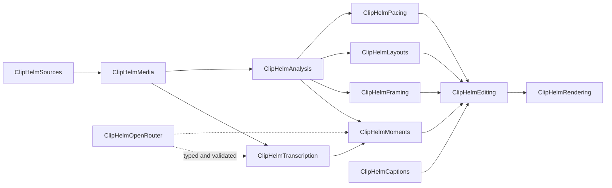

<p align="center">
  
</p>

<p align="center">
  
</p>

<p align="center">
  <a href="https://git.io/typing-svg">
    
  </a>
</p>

<p align="center">
  
  
  
  
  
</p>

<p align="center">
  
</p>

ClipHelm is a native macOS app for creators, and the editors they hire, to turn their **own** long-form videos into short, captioned clips. Paste a YouTube link or drop in a video file, pick a format and caption style, and press **Start**. ClipHelm finds the strongest moments, frames each one for vertical or horizontal feeds, cuts dead air, burns in captions, and renders clips ready to post.

Analysis, framing, editing, and rendering run on this Mac. AI is used where it earns its place, through your own OpenRouter key, and only after you choose it.

---

## Features

- **Paste and go.** Paste a YouTube link on Home; the download starts at once and runs while you choose options. Local MP4, MOV, and MKV files work too, by dropping them in.
- **Best moments, ranked.** A structured text model reads bounded transcript excerpts and picks self-contained moments. Each clip shows its **viral chance**, an estimate from hook, interest, completeness, and story, and the model's reason.
- **Smart Auto Frame.** Checks each clip 5 times a second for faces, mouth movement, and the objects in view, and finds camera cuts at the exact frame. The crop cuts when the camera cuts, holds still for a talking head, follows whoever is talking in a wide two-shot, and aims at the product in shots without a face. The subject's face is always kept fully in frame.
- **Smart layouts.** Speaker focus, stacked speakers, side by side, screen focus, screen + speaker, and picture-in-picture, chosen from local evidence with hysteresis so layouts don't flicker.
- **Captions.** Eight styles (Pop, Spotlight, Impact, Glow Box, Editorial, High Punch, Neon Headline, Paper) with optional word-by-word animation and blur-in, timed to the word.
- **Smart editing.** Cut dead air, trim long pauses, remove filler words, and keep screen demos intact, at four pacing levels: Natural, Balanced, Tight, and Fast.
- **Review and refine.** Play any clip, then rename, trim, change framing, pacing, or captions, or regenerate framing, and preview the result before exporting.
- **Export.** 9:16 or 16:9, at 1080p or 4K. Download one clip, a selection, or all of them to a folder.
- **Projects stay on your Mac.** Choices, transcripts, and generated clips are saved locally and restored on relaunch.

---

## Quick start

1. **Build and open** the app (see [Build from source](#build-from-source)).
2. **Add your OpenRouter key** on Home, or in **ClipHelm › Settings… › OpenRouter** (`⌘,`). It is stored only in the macOS Keychain.
3. **Paste a YouTube link** for a video you own or may process, confirm permission, and choose **Choose Clip Options**. For a local file, choose **New Clip Project** (`⌘N`).
4. **Pick the direction:** format and resolution, framing, smart editing and pacing, clip lengths, how many clips, sound, captions, and AI models.
5. **Create the project and press Start** (`⌘↩`). Each phase shows its own progress: download, transcription, scene analysis, moment finding, framing, and rendering.
6. **Review and download.** Clips appear at the top of the workspace, strongest first.

Shortcuts: `⌘1` Home · `⌘2` Recent Projects · `⌘[` / `⌘]` previous / next setup step · `⌘I` inspector · `⌘S` save clip edits.

---

## AI and models

ClipHelm does not hardcode a model list; it reads OpenRouter's live catalog and recommends a model for each task. You can change any choice in the **AI Models** step.

| Task | Default | Alternative | What is sent |
|---|---|---|---|
| **Transcription** | Recommended OpenRouter model with word timings (Deepgram Nova-3, then Parakeet, Whisper, or Qwen ASR) | **On this Mac**: Apple `SpeechAnalyzer` on macOS 26+ (`SFSpeechRecognizer` on 14–15), free and slower | Two-minute audio chunks, four at a time; a few cents per hour of audio. Never the video. |
| **Moment finding** | Recommended structured text model | Any structured-output model in the catalog | Bounded transcript excerpts from local candidate windows |
| **AI Vision** (optional) | Off | Turn on **Check tricky shots with AI Vision** | Two 512-pixel frames from at most three uncertain shots |

Every AI result is typed and validated before use. A model can suggest moments and content labels; crop coordinates, layouts, file paths, and commands are always decided locally. Without a transcript, ClipHelm still suggests visually active moments locally, with no AI call.

---

## How it works

```text
Source (YouTube link or local file)
  → download (yt-dlp) and validation
  → transcription (OpenRouter or on this Mac)
  → local scene, motion, audio, and subject analysis
  → moment finding and viral-chance ranking
  → focus sampling: frame-accurate cuts, faces, salient objects
  → edit plan: pacing cuts, layouts, crop paths, captions
  → render previews and finals (AVFoundation, H.264)
```

A saved transcript and analysis cache are reused, so a later failure doesn't repeat finished work. Processing belongs to the app, not the screen, so it keeps running while you browse other projects.

---

## Requirements

- macOS 14 or later. On-device transcription uses `SpeechAnalyzer` on macOS 26 and later, and `SFSpeechRecognizer` before that.
- Apple Silicon (the build script produces an arm64 app)
- An [OpenRouter](https://openrouter.ai) API key for OpenRouter transcription and moment finding
- Building the app bundle needs Xcode 26 or later (its `actool` compiles the Icon Composer icon); `swift build` and `swift test` need only Swift 6
- FFmpeg is **not** required. If AVFoundation can't decode a file, an installed `ffmpeg` in `/opt/homebrew/bin` or `/usr/local/bin` is used as a local fallback.

---

## Privacy

| What | Where it lives |
|---|---|
| OpenRouter API key | macOS login Keychain only; never in projects or preferences |
| Projects | `~/Library/Application Support/ClipHelm/Projects`: choices, a source label, media metadata, transcripts, and clip specs. Never source file paths or full remote URLs. |
| Generated clips | Each project's `Exports` folder |
| Original media | Read only, never modified. A large source gets a 720p editing proxy in temporary storage. |
| Audio sent to OpenRouter | Only when you choose OpenRouter transcription: short audio chunks, never the video |
| Transcript excerpts | Only for moment finding, bounded to candidate windows |
| Frames sent to OpenRouter | Only with AI Vision turned on: two 512-pixel frames per uncertain shot, at most three shots |

**YouTube import.** The first import installs the official `yt-dlp_macos` release into `~/Library/Application Support/ClipHelm/Tools` after checking it against the release's SHA-256 checksum; **Settings › Downloader** updates it. A Homebrew `yt-dlp` also works. ClipHelm downloads H.264 video and AAC audio separately (up to 1080p) and combines them with AVFoundation. It never passes cookies or sign-in credentials, so private, members-only, age-restricted, and DRM-protected videos stay unavailable. Direct video URL import is disabled until its download transport can prevent DNS rebinding.

After relaunch, generated clips play, rename, and export from saved files. Re-attach the original (**Locate Original Video**, or re-enter the YouTube link) before edits that need rendering.

Full boundary: [Privacy](PRIVACY.md) and [Security](SECURITY.md).

---

## Build from source

```bash
git clone https://github.com/BuilderHelm/ClipHelm.git
cd ClipHelm
scripts/build-app.sh
open build/ClipHelm.app
```

`scripts/build-app.sh release` makes an ad hoc–signed release build for local testing; set `CLIPHELM_SIGNING_IDENTITY` to a Developer ID identity for distribution. See [Distribution](docs/DISTRIBUTION.md).

---

## Verify

```bash
swift test --disable-sandbox
```

The suite covers source validation, media and time mapping, transcription, local analysis, moment discovery, Smart Auto Frame, edit planning, project restoration and migrations, clip revisions and batch export, mocked OpenRouter behavior, Keychain input validation, a network-free full processing run, and short 1080p/4K H.264 exports with crops, captions, and audio. The live Keychain test needs Keychain access.

Opt-in checks run against real media and skip by default:

| Check | Run with |
|---|---|
| Smart Auto Frame before/after on a real project | `CLIPHELM_FRAMING_PROJECT=<project folder> CLIPHELM_FRAMING_SOURCE=<video> swift test --disable-sandbox --filter FramingBenchmarkTests` |
| Off-screen layout snapshots for design review | `CLIPHELM_SNAPSHOT_DIR=/tmp/shots swift test --disable-sandbox --filter UISnapshotTests` |
| Long-timeline moment profile | `CLIPHELM_RUN_LONG_BENCHMARKS=1 swift test --disable-sandbox --filter MomentEngineTests` |

Fixtures check structure, not perceptual quality. Check UI changes in the built app, in light and dark mode and at the 780 × 560 minimum window. See the [quality baseline](docs/QUALITY_BENCHMARK.md).

---

## Architecture



| Target | Responsibility |
|---|---|
| `ClipHelmApp` | SwiftUI app, design system, projects, processing UI |
| `ClipHelmCore` | Validated domain types: time, media, moments, EditSpec |
| `ClipHelmSources` | Local files and YouTube import (yt-dlp, stream muxing) |
| `ClipHelmMedia` | Probing, proxies, thumbnails, playback, FFmpeg fallback |
| `ClipHelmTranscription` | OpenRouter and on-device speech backends |
| `ClipHelmAnalysis` | Scenes, motion, audio, subjects, dense focus evidence |
| `ClipHelmMoments` | Candidate windows, AI ranking, viral chance |
| `ClipHelmFraming` / `ClipHelmFramingVision` | Smart Auto Frame; optional AI Vision labels |
| `ClipHelmLayouts` / `ClipHelmLayoutVision` | Shot layouts; optional screen-content labels |
| `ClipHelmPacing` | Dead air, long pauses, filler words |
| `ClipHelmCaptions` | Caption tracks and rendering |
| `ClipHelmEditing` | Clip planning, edit timeline, undo/redo |
| `ClipHelmRendering` | AVFoundation composition and export |
| `ClipHelmProcessing` | End-to-end processing coordinator |
| `ClipHelmProjects` | Project schema, migrations, derived artifacts |
| `ClipHelmOpenRouter` / `ClipHelmSecurity` | AI gateway, model registry, Keychain vault |

---

## Documentation

| Document | What it covers |
|---|---|
| [Architecture](docs/ARCHITECTURE.md) | Module contracts and the processing path |
| [Design system](docs/DESIGN_SYSTEM.md) | Tokens, components, button hierarchy, screen structure |
| [EditSpec](docs/EDIT_SPEC.md) | The validated edit plan every render follows |
| [Moment engine](docs/MOMENT_ENGINE.md) | How moments are found and ranked |
| [Project format](docs/PROJECT_FORMAT.md) | What a saved project contains |
| [Quality baseline](docs/QUALITY_BENCHMARK.md) | Benchmarks, including Smart Auto Frame on real footage |
| [Privacy](PRIVACY.md) / [Security](SECURITY.md) | What stays local and what can leave |
| [Distribution](docs/DISTRIBUTION.md) | Signing, notarization, packaging |
| [Release checklist](docs/RELEASE_CHECKLIST.md) | The external release gate |
| [V2 architecture](docs/V2_ARCHITECTURE.md) | MomentGraph and the V2 roadmap foundations |

---

## Status

ClipHelm is in active development and **not yet cleared for external release**; see the [release gate](docs/RELEASE_CHECKLIST.md). Developer ID signing and notarization, licensing, and real-video quality review remain open. ClipHelm is built for creators clipping content they own or are authorized to process.

<p align="center">
  <em>Paste a link. Press Start. Post the clips.</em>
</p>

<p align="center">
  
</p>
